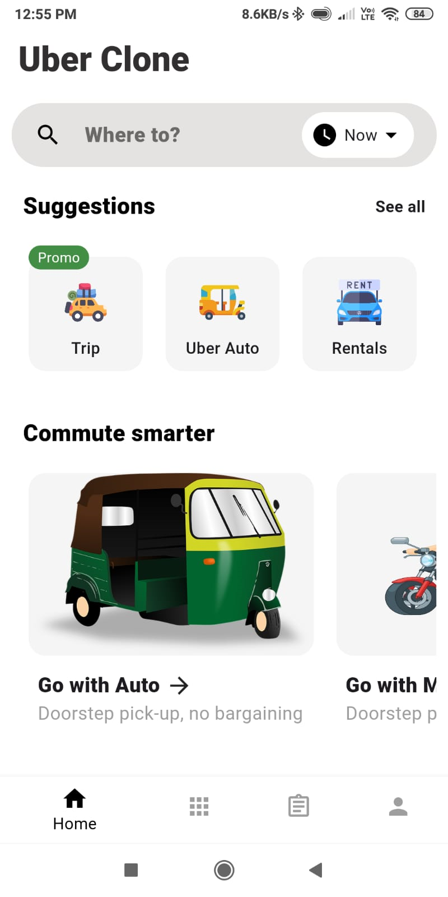
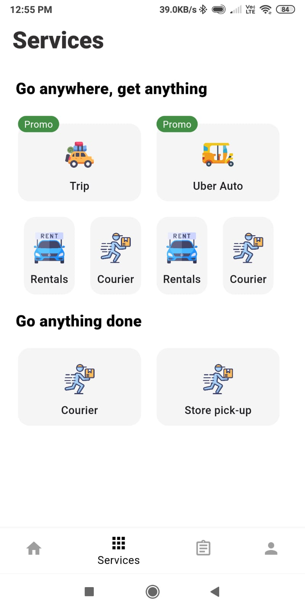
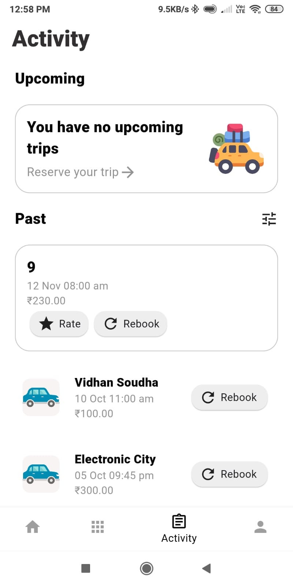
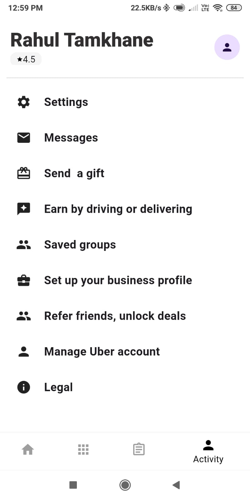

# Uber Clone

A Uber clone app developed in Flutter .

## Getting Started

### Technologies used
1. [Flutter](https://flutter.dev/)
2. [Dart](https://dart.dev/)

### Demo
You can download the project by running following command and run on virual device:
```
git clone https://github.com/rahultamkhane/Uber-Clone.git
git Uber-Clone
flutter run
```

### Screenshots
#### Home Screen
<kbd><br></kbd>
#### Services Screen
<kbd><br></kbd>
#### Activity Screen
<kbd><br></kbd>
#### Account Screen
<kbd><br></kbd>
